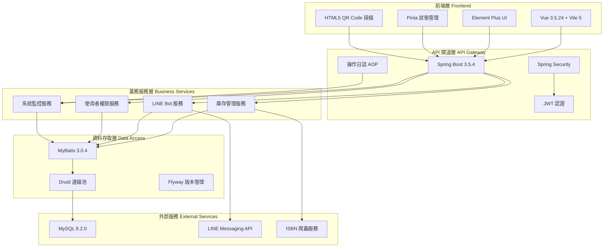

# CoolApps 管理系統


> 🚀 現代化企業管理系統，整合庫存管理、LINE Bot 機器人、使用者權限管理等核心功能

## 📖 專案簡介

CoolApps 是一個基於若依(RY)專案修改的 Spring Boot + Vue 3 的現代化企業管理平台，採用前後端分離架構設計。系統整合了庫存管理、LINE Bot 機器人、使用者權限管理、系統監控等核心模組，提供完整的企業級解決方案。

### ✨ 核心亮點

- 🏗️ **現代化架構**：Spring Boot 3.5.4 + Vue.js 3.5.24 + Vite 5 + Pinia 前後端分離
- 🐳 **容器化部署**：Docker + Docker Buildx 多平台支援
- 🔐 **安全可靠**：JWT Token 認證 + Spring Security 權限控制 + Jasypt 加密
- 🎨 **優雅介面**：Element Plus 2.11.8（繁體中文）現代化 UI 框架
- 📱 **行動端支援**：QR Code/條碼掃描、ISBN 爬蟲、響應式設計
- 🤖 **LINE Bot 整合**：Rich Menu 管理、推播訊息、使用者管理
- 📊 **資料分析**：庫存報表、操作日誌、系統監控儀表板

## 🏗️ 系統架構



## 🛠️ 技術棧

### 後端

| 類別 | 技術 | 版本 | 說明 |
|------|------|------|------|
| **核心框架** | Spring Boot | 3.5.4 | 應用程式框架 |
| **Java 版本** | OpenJDK | 17 | 長期支援版本 |
| **資料庫** | MySQL | 8.2.0 | 關聯型資料庫 |
| **ORM 框架** | MyBatis | 3.0.4 | 資料存取層 |
| **連線池** | Druid | 1.2.23 | 資料庫連線池 |
| **安全框架** | Spring Security + JWT | - | 認證授權 |
| **版本管理** | Flyway | 11.14.1 | 資料庫遷移 |
| **API 文件** | SpringDoc OpenAPI | 2.8.9 | Swagger 文件 |
| **工具庫** | Lombok | 1.18.42 | 程式碼簡化 |
| **HTTP 客戶端** | OkHttp | 4.12.0 | HTTP 請求工具 |

### 前端

| 類別 | 技術 | 版本 | 說明 |
|------|------|------|------|
| **核心框架** | Vue.js | 3.5.24 | 漸進式 JavaScript 框架 |
| **建置工具** | Vite | 5.4.21 | 現代化建置工具 |
| **狀態管理** | Pinia | 2.3.1 | Vue 狀態管理庫 |
| **UI 框架** | Element Plus | 2.11.8 | Vue 3 UI 組件庫 |
| **圖標庫** | Element Icons | 2.3.2 | SVG 圖標組件 |
| **路由管理** | Vue Router | 4.6.3 | 前端路由 |
| **HTTP 客戶端** | Axios | 0.28.1 | HTTP 請求庫 |
| **套件管理** | pnpm | - | 高效套件管理器 |
| **掃描功能** | HTML5-QRCode | 2.3.8 | QR Code/條碼掃描 |
| **圖表庫** | ECharts | 5.4.0 | 資料可視化 |

## 🌍 環境變數配置

| 變數名稱 | 描述 | 必需 | 預設值 |
|----------|------|------|--------|
| JASYPT_ENCRYPTOR_PASSWORD | 解密配置檔案的密碼 | 是 | - |
| SPRING_PROFILES_ACTIVE | 啟動環境 | 是 | local |
| VUE_APP_BASE_API | 前端 API 基礎路徑 | 否 | /dev-api |

> **注意**：Jasypt 加密密碼用於解密 `application-*.yml` 中的敏感配置，請聯絡專案管理員取得實際密碼。

## 🚀 快速開始

### 環境需求

- **Java**：JDK 17+
- **Node.js**：18.0.0+
- **pnpm**：8.0.0+
- **MySQL**：8.0+
- **Maven**：3.8+

### 本地開發

1. **複製專案**
   ```bash
   git clone https://github.com/mark22013333/Cheng-Vue.git.git
   cd Cheng-Vue
   ```

2. **後端啟動**
   ```bash
   # 啟動後端服務（需要 Jasypt 密碼）
   mvn spring-boot:run -Dspring-boot.run.profiles=local -Djasypt.encryptor.password=YOUR_JASYPT_PASSWORD
   ```

3. **前端啟動**
   ```bash
   cd cheng-ui
   pnpm install
   pnpm run dev
   ```

4. **訪問系統**
   - 前端網址：http://localhost:3000
   - 後端 API：http://localhost:8080
   - API 文件：http://localhost:8080/swagger-ui.html

## 📁 專案主要結構

```
Cheng-Vue/
├── cheng-admin/          # 管理後台模組
│   ├── src/main/java/    # Java 原始碼
│   └── src/main/resources/ # 配置檔案
├── cheng-common/         # 共用模組
│   ├── src/main/java/    # 工具類、枚舉、註解
│   └── src/main/resources/ # 共用資源
├── cheng-system/         # 系統模組
│   ├── src/main/java/    # 系統核心功能
│   └── src/main/resources/ # MyBatis Mapper
├── cheng-crawler/        # 爬蟲模組
│   ├── src/main/java/    # ISBN 爬蟲服務
│   └── src/main/resources/ # 爬蟲配置
├── cheng-ui/             # 前端專案
│   ├── src/              # Vue 原始碼
│   ├── public/           # 靜態資源
│   ├── package.json      # 前端依賴
│   └── vite.config.js    # Vite 配置
├── cheng.deploy/         # 部署腳本
│   ├── build-frontend.sh # 前端建置腳本
│   ├── deploy-backend.sh # 後端部署腳本
│   └── nginx/            # Nginx 配置
├── pom.xml               # Maven 配置
├── README.md             # 專案說明
```

## 🎯 核心功能

### 📦 庫存管理系統

- **物品管理**：支援物品分類、庫存查詢、入庫出庫操作
- **QR Code 掃描**：整合 HTML5-QRCode，支援攝影機即時掃描
- **ISBN 爬蟲**：自動取得書籍資訊和封面圖片
- **借出管理**：完整的借出審核流程和歸還管理
- **庫存報表**：多維度庫存統計和 Excel 匯出

### 🤖 LINE Bot 整合

- **Rich Menu 管理**：視覺化圖文選單編輯器
- **推播訊息**：支援文字、圖片、貼圖等多媒體訊息（未完成）
- **使用者管理**：LINE 使用者資訊同步和管理
- **選單切換**：支援動態切換不同 Rich Menu

### 👥 使用者權限管理

- **角色管理**：靈活的權限角色配置
- **部門管理**：樹狀部門結構管理
- **選單權限**：細粒度的功能權限控制
- **資料權限**：基於部門的資料訪問控制

### 📊 系統監控

- **操作日誌**：完整的使用者操作記錄
- **登入日誌**：登入成功/失敗記錄
- **系統監控**：CPU、記憶體、磁碟使用情況
- **Druid 監控**：資料庫連線池監控

## 🚀 部署指南

### Docker 部署

```bash
# 建置映像
docker build -t cheng-app:latest .

# 啟動容器
docker-compose up -d
```

## 🔄 更新日誌

### v2.0.0 (2025-11-30) - 重大更新

- 🚀 **核心架構全面升級**：前端遷移至 Vue 3.5 + Vite 5 + Pinia，採用 Composition API 重構，大幅提升建置速度與執行效能
- 🎨 **UI 介面現代化**：導入 Element Plus 框架與全 SVG Icon 組件，優化登入頁面視覺、新增側邊欄拖曳調整寬度功能及個人中心多色主題切換
- 📱 **行動端掃描重構**：庫存掃描功能升級，新增相機變焦 (Zoom) 控制、懸浮操作按鈕，並整合 ISBN 爬蟲與 SSE 即時進度顯示
- 🤖 **LINE 模組優化**：重構 Rich Menu 圖文選單編輯器，解決版面配置問題並支援即時發布狀態監控；優化使用者頭像裁切工具
- 🔧 **系統標準化與修復**：修復動態路由命名衝突，並增強開發環境的錯誤日誌排查機制

### v1.6.5 (2025-11-22) - 功能更新

- 🔧 **系統配置鍵管理**：使用 SystemConfigKey Enum 統一管理 sys_config 配置鍵
- 📊 **庫存報表優化**：調整報表介面樣式，優化統計區塊佈局
- 🔍 **掃描記錄改進**：報表顯示邏輯優化，新增錯誤訊息欄位
- 🔄 **Tab 切換優化**：新增共用的 Tab 與 Card 切換自動更新機制

完整更新日誌請參考系統內「更新日誌」模組

## 📖 API 文件

系統提供 API 文件，基於 OpenAPI 3.0 規範：

- **Swagger UI**：http://localhost:8080/swagger-ui.html
- **API JSON**：http://localhost:8080/v3/api-docs

## 🤝 貢獻指南

1. Fork 專案
2. 建立功能分支 (`git checkout -b feature/AmazingFeature`)
3. 提交變更 (`git commit -m 'Add some AmazingFeature'`)
4. 推送到分支 (`git push origin feature/AmazingFeature`)
5. 建立 Pull Request

## 📄 授權協議

本專案採用 MIT 授權協議 - 詳情請參考 [LICENSE](LICENSE) 檔案

## 📞 聯絡方式

- **GitHub Repo**：https://github.com/mark22013333/Cheng-Vue.git
- **線上Demo**：https://cool-apps.zeabur.app (每月免費額度超過則 503)
- **問題回報**：[Issues](https://github.com/mark22013333/Cheng-Vue.git/issues)

---

<div align="center">

**⭐ 如果這個專案對你有幫助，請給我們一個 Star！**

Made with ❤️ by CoolApps Team

</div>
