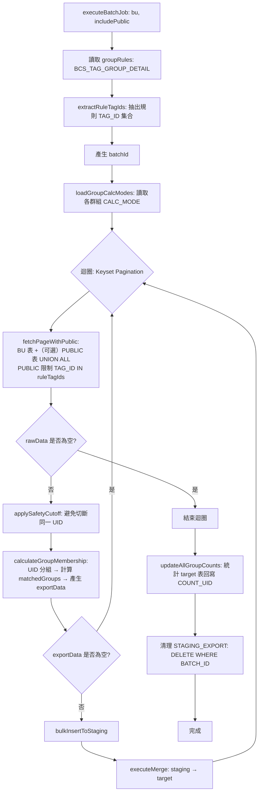
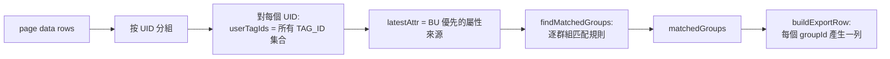

# 標籤群組（Tag Group）批次運算邏輯與流程說明報告

## 1. 範圍與目標

本報告描述 `TagGroupBatchService` 的批次運算流程與「標籤群組規則」的運算邏輯，包含：

- **資料來源合併**：BU 專屬匯出表 + `BCS_REPORT_EXPORT_PUBLIC`（由 `includePublic` 控制是否併入）
- **屬性優先權**：`latestAttr` 優先取 BU 資料，沒有才用 PUBLIC
- **群組規則運算模式（CALC_MODE）**：同一群組依設定切換不同規則解讀方式
  - `LEFT_TO_RIGHT`（預設）
  - `OR_OF_AND`

---

## 2. 核心資料與表格

### 2.1 規則表

- **`BCS_TAG_GROUP_LIST`**
  - `TAG_GROUP_ID`：群組 ID
  - `BU`：所屬 BU
  - `CALC_MODE`：運算模式（`NULL` 視為 `LEFT_TO_RIGHT`）
  - `COUNT_UID`：批次結果回寫的群組人數

- **`BCS_TAG_GROUP_DETAIL`**
  - `TAG_GROUP_ID`
  - `GROUP_INDEX`：規則順序（用於 `LEFT_TO_RIGHT`）
  - `TAG_ID`
  - `OPERATOR`：`AND` / `OR`（第一筆可能空字串）

### 2.2 來源資料表（User-Tag 資料）

- BU 專屬匯出表（依 BU 映射取得）
  - `BCS_REPORT_EXPORT_FINANCE` / `BCS_REPORT_EXPORT_BANK` / `BCS_REPORT_EXPORT_LIFE_INSURANCE` / ...
- 公共匯出表
  - `BCS_REPORT_EXPORT_PUBLIC`

### 2.3 目標表（群組匯出結果）

- `BCS_BU_{BU}_GROUP_EXPORT`
  - 每個符合群組的 UID 會產生一筆（含 BU/綁定狀態/點擊欄位/ATTACH_TAG_TIME 等）

### 2.4 共用暫存表

- `STAGING_EXPORT`
  - 批次寫入暫存（以 `BATCH_ID` 隔離），再 MERGE 到 target

---

## 3. 批次處理總流程（高階）

### 3.1 流程概覽

1. 讀取群組規則：`TagGroupDetailRepository` 取出所有 `BCS_TAG_GROUP_DETAIL`
2. 抽取規則中用到的 `TAG_ID`（用於 PUBLIC 表過濾）
3. 以 **Keyset Pagination** 分頁查詢來源資料（BU + 可選 PUBLIC）
4. Safety Cutoff 避免切斷同一 UID
5. 記憶體運算：依 UID 彙整 tag set → 找出符合群組 → 組裝匯出列
6. 批次寫入 staging
7. MERGE staging → target
8. 批次結束後統計 `COUNT_UID` 回寫 `BCS_TAG_GROUP_LIST`
9. 清理 staging（刪除該 `BATCH_ID`）

---

## 4. 流程圖（批次主流程）

---

## 5. 來源資料合併邏輯（BU + PUBLIC）

### 5.1 目標

- **所有 BU 都可以併入 PUBLIC**
- PUBLIC 表資料量很大，因此要 **先用規則 TAG_ID 過濾**，避免全表掃描
- 同一 UID 的 tag 來源可能同時存在 BU 與 PUBLIC

### 5.2 合併策略

- 查詢時使用 `UNION ALL`
- 以 `SOURCE_TYPE`（BU / PUBLIC）標記每筆來源
- 記憶體運算時：
  - `userTagIds` = 同 UID 的所有 `TAG_ID` 合併（BU + PUBLIC）
  - `latestAttr`：優先取 `SOURCE_TYPE='BU'` 的那筆屬性資料，否則取第一筆（可能是 PUBLIC）

---

## 6. 群組規則運算：兩種模式

### 6.1 輸入資料形式

對單一群組（`TAG_GROUP_ID`）而言，規則是一串依序的條目：

- `T1 (op?)`, `T2 op2`, `T3 op3`, ...

其中 `op2` 表示「把 T2 與前一段結果如何組合」。
第一筆 `operator` 通常可視為空（不參與運算）。

---

### 6.2 模式 A：`LEFT_TO_RIGHT`（預設）

**定義**：按照 `GROUP_INDEX` 排序，從左到右逐步 fold，不套用一般布林優先權。

- 規則：`A AND B OR C AND D OR E`
- 解析：`((((A AND B) OR C) AND D) OR E)`

**判斷方式（布林版）**：

1. `result = has(A)`
2. 依序讀取下一條：
   - 遇到 `AND`：`result = result && has(tag)`
   - 否則（`OR` 或空）：`result = result || has(tag)`

此模式的本質：**使用者看到的順序就是系統運算順序**。

---

### 6.3 模式 B：`OR_OF_AND`（現行模式）

**定義**：把整串規則依 `OR` 切段；每段內為 `AND`，最後段與段之間做 `OR`。

- 規則：`A AND B OR C AND D OR E`
- 解析：`(A AND B) OR (C AND D) OR (E)`

**判斷方式**：

1. 先切成多個 AND 群組（OR 分隔）
2. 只要任一群組「全部 tag 都存在」即為符合

此模式更像一般 DNF（析取范式）表達：OR 是群組層級，AND 是群組內條件。

---

## 7. 運算模式選擇（CALC_MODE）如何生效

### 7.1 讀取

批次開始時會查詢：

- `BCS_TAG_GROUP_LIST` 取出 `TAG_GROUP_ID -> CALC_MODE` 映射（同 BU）

### 7.2 預設

- 若 `CALC_MODE` 為 `NULL` 或空字串：視為 `LEFT_TO_RIGHT`

### 7.3 套用位置

在 `findMatchedGroups(userTagIds, allRules, groupCalcModes)`：

- 每個 groupId 取出 calcMode
- `OR_OF_AND` → 用 `isGroupMatchedOrOfAnd`
- 其他（含 NULL）→ 用 `isGroupMatchedLeftToRight`

---

## 8. 記憶體運算的資料流

---

## 9. 重要特性與風險點（實務注意）

- **Keyset Pagination**：避免 OFFSET 大量資料時效能崩壞
- **Safety Cutoff**：確保同一 UID 的資料不會被切到不同頁導致漏算
- **PUBLIC 表過濾**：一定要用 `TAG_ID IN (ruleTagIds)`，否則 PUBLIC 量大會拖垮
- **latestAttr 優先權**：BU > PUBLIC，避免公共資料覆蓋 BU 專屬欄位
- **CALC_MODE 預設**：NULL 視為 `LEFT_TO_RIGHT`，避免舊資料行為不明
- **資料一致性**：透過 staging + merge，避免直接大量 insert/update 對 target 造成鎖與碎片化

