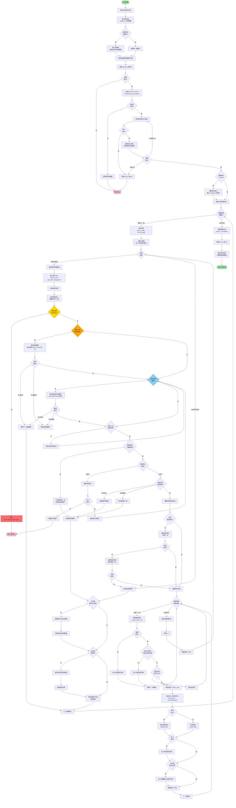

```mermaid
flowchart TB
Start([程式啟動]) --> Init[初始化設定與日誌]
Init --> LoadConfig[載入設定檔<br/>config.ini / 環境變數]
LoadConfig --> CheckKeyword{處理所有<br/>關鍵字?}

    CheckKeyword -->|是| LoadProgress[載入進度檔<br/>檢查是否有中斷續跑]
    CheckKeyword -->|否| SelectKeyword[選擇單一關鍵字]
    
    LoadProgress --> SetKeywords[設定要處理的關鍵字清單]
    SelectKeyword --> SetKeywords
    
    SetKeywords --> ConnectDB[連接 MSSQL 資料庫]
    ConnectDB --> DBSuccess{連線<br/>成功?}
    DBSuccess -->|否| End1([程式終止])
    DBSuccess -->|是| InitDriver[初始化 Chrome Driver<br/>undetected_chromedriver]
    
    InitDriver --> DriverSuccess{初始化<br/>成功?}
    DriverSuccess -->|否| CloseDB1[關閉資料庫連線]
    CloseDB1 --> End1
    
    DriverSuccess -->|是| WaitLogin[等待使用者登入蝦皮]
    WaitLogin --> LoginSuccess{登入<br/>成功?}
    LoginSuccess -->|否| CloseAll1[關閉 Driver 與 DB]
    CloseAll1 --> End1
    
    LoginSuccess -->|是| VerifyLogin[驗證登入狀態<br/>訪問蝦皮首頁確認]
    VerifyLogin --> VerifySuccess{驗證<br/>成功?}
    VerifySuccess -->|否,重試3次| WaitLogin
    VerifySuccess -->|失敗3次| CloseAll1
    
    VerifySuccess -->|是| CheckRetryMode{補抓模式<br/>= before?}
    CheckRetryMode -->|是| RetryMissing[補抓資料庫中<br/>缺少 Category 的賣家]
    RetryMissing --> StartCrawl[開始正常爬蟲流程]
    CheckRetryMode -->|否| StartCrawl
    
    StartCrawl --> KeywordLoop{遍歷每個<br/>關鍵字}
    
    KeywordLoop -->|處理下一個| SaveProgress1[儲存進度<br/>current_index, current_page]
    SaveProgress1 --> InitPage[初始化頁碼<br/>從 0 或中斷頁開始]
    
    InitPage --> PageLoop{頁面<br/>循環}
    
    PageLoop -->|處理當前頁| SavePageProgress[儲存當前頁碼進度]
    SavePageProgress --> BuildURL[建立搜尋 URL<br/>search_user?keyword=xxx&page=N]
    BuildURL --> VisitPage[訪問搜尋頁面]
    VisitPage --> WaitLoad[等待頁面載入<br/>隨機等待 5-10秒]
    
    WaitLoad --> CheckWarning{檢查帳號<br/>警告頁面?}
    CheckWarning -->|是| ThrowException[拋出 AccountWarningException]
    ThrowException --> End2([程式立即終止])
    
    CheckWarning -->|否| CheckError{檢查一般<br/>錯誤頁面?}
    CheckError -->|是| HandleError[嘗試處理錯誤<br/>最多重試 MAX_RETRIES 次]
    HandleError --> ErrorFixed{錯誤<br/>修復?}
    ErrorFixed -->|否,第0頁| NextKeyword1[跳到下一個關鍵字]
    ErrorFixed -->|否,後續頁| EndPage1[結束當前關鍵字]
    
    ErrorFixed -->|是| CheckCaptcha{檢查滑塊<br/>驗證?}
    CheckError -->|否| CheckCaptcha
    
    CheckCaptcha -->|是| WaitCaptcha[等待使用者完成驗證<br/>infinite 或 timeout 模式]
    WaitCaptcha --> CaptchaSuccess{驗證<br/>成功?}
    CaptchaSuccess -->|否,第0頁| NextKeyword1
    CaptchaSuccess -->|否,後續頁| EndPage1
    
    CaptchaSuccess -->|是| CheckURL{當前 URL<br/>是搜尋頁?}
    CheckCaptcha -->|否| CheckURL
    
    CheckURL -->|否| RedirectSearch[重新導向到搜尋頁]
    RedirectSearch --> CheckCaptcha
    CheckURL -->|是| CheckPageNum{實際頁碼<br/>= 預期頁碼?}
    
    CheckPageNum -->|否| LastPage1[已到達最後一頁<br/>結束當前關鍵字]
    CheckPageNum -->|是| CheckLoginStatus{檢查登入<br/>狀態?}
    
    CheckLoginStatus -->|未登入| ReLogin[重新等待登入]
    ReLogin --> ReLoginSuccess{登入<br/>成功?}
    ReLoginSuccess -->|否| CloseAll2[關閉所有連線]
    CloseAll2 --> End2
    ReLoginSuccess -->|是| ReloadPage[重新載入當前頁]
    ReloadPage --> CheckCaptcha
    
    CheckLoginStatus -->|已登入| CheckEmpty{檢查是否<br/>空結果頁?}
    CheckEmpty -->|是,第0頁| NoResult[該關鍵字無賣家]
    CheckEmpty -->|是,後續頁| LastPage2[已到達最後一頁]
    NoResult --> EndPage2[結束當前關鍵字]
    LastPage1 --> EndPage2
    LastPage2 --> EndPage2
    
    CheckEmpty -->|否| ExtractLinks[擷取賣家連結列表]
    ExtractLinks --> HasLinks{找到<br/>賣家連結?}
    
    HasLinks -->|否| RetryExtract[自動重新導向<br/>再試一次]
    RetryExtract --> RetrySuccess{重試<br/>成功?}
    RetrySuccess -->|否| AdvancedRecover[進階恢復流程<br/>最多重試 3 次]
    AdvancedRecover --> RecoverSuccess{恢復<br/>成功?}
    RecoverSuccess -->|否| EndPage3[結束當前關鍵字]
    RecoverSuccess -->|是| ProcessSellers[處理賣家列表]
    RetrySuccess -->|是| ProcessSellers
    HasLinks -->|是| ProcessSellers
    
    ProcessSellers --> SellerLoop{遍歷每個<br/>賣家連結}
    
    SellerLoop -->|處理下一個| ExtractInfo[擷取賣家資訊<br/>extract_seller_info]
    ExtractInfo --> InfoSuccess{擷取<br/>成功?}
    
    InfoSuccess -->|否| AddFailed1[加入失敗重試列表]
    AddFailed1 --> NextSeller1[處理下一個賣家]
    
    InfoSuccess -->|是| HasCoreData{有核心資料?<br/>商品/粉絲/評價}
    HasCoreData -->|否| AddFailed2[加入失敗重試列表]
    AddFailed2 --> NextSeller1
    
    HasCoreData -->|是| ValidForDB{資料有效<br/>可寫入DB?}
    ValidForDB -->|否| NextSeller2[跳過此賣家]
    
    ValidForDB -->|是| AddToMap[將賣家加入 seller_map]
    AddToMap --> CheckExists[查詢 DB 中是否存在<br/>同 Auction + SearchKeyword]
    
    CheckExists --> Exists{資料<br/>存在?}
    Exists -->|是| UpdateDB[更新現有資料<br/>update_data]
    Exists -->|否| InsertDB[新增資料<br/>insert_data]
    
    UpdateDB --> DBWriteSuccess{寫入<br/>成功?}
    InsertDB --> DBWriteSuccess
    DBWriteSuccess -->|否| AddFailed3[加入失敗重試列表]
    
    DBWriteSuccess -->|是| CheckCategory{有分類<br/>和出貨地?}
    AddFailed3 --> CheckCategory
    
    CheckCategory -->|否| AddPending[加入待補類別/出貨地列表]
    AddPending --> WaitRandom1[隨機等待 2-5秒]
    CheckCategory -->|是| WaitRandom1
    WaitRandom1 --> NextSeller3[下一個賣家]
    
    NextSeller1 --> SellerLoop
    NextSeller2 --> SellerLoop
    NextSeller3 --> SellerLoop
    
    SellerLoop -->|全部完成| PageComplete[當前頁處理完成]
    PageComplete --> NextPage[頁碼 +1]
    NextPage --> WaitRandom2[隨機等待 2-5秒]
    WaitRandom2 --> PageLoop
    
    PageLoop -->|全部頁面完成| EndPage3
    EndPage2 --> RetryCategory{有待補<br/>類別/出貨地?}
    EndPage3 --> RetryCategory
    
    RetryCategory -->|是| RetryCategoryLoop[補抓類別/出貨地循環]
    RetryCategoryLoop --> RetryDone1[記錄成功與失敗數量]
    RetryDone1 --> HasFailed{有失敗<br/>的賣家?}
    RetryCategory -->|否| HasFailed
    
    HasFailed -->|是| RetryFailedLoop[重試失敗的賣家循環]
    RetryFailedLoop --> RetryDone2[記錄重試結果]
    RetryDone2 --> KeywordComplete[標記關鍵字完成<br/>儲存進度]
    HasFailed -->|否| KeywordComplete
    
    KeywordComplete --> NextKeyword2[下一個關鍵字]
    NextKeyword1 --> NextKeyword2
    NextKeyword2 --> KeywordLoop
    
    KeywordLoop -->|全部完成| MarkComplete[標記整體完成<br/>status = completed]
    MarkComplete --> CloseAll3[關閉 Driver 與 DB]
    CloseAll3 --> OutputStats[輸出統計資訊<br/>總處理賣家數量]
    OutputStats --> End3([程式正常結束])
    
    style Start fill:#90EE90
    style End1 fill:#FFB6C1
    style End2 fill:#FFB6C1
    style End3 fill:#90EE90
    style ThrowException fill:#FF6B6B
    style CheckWarning fill:#FFD700
    style CheckError fill:#FFA500
    style CheckCaptcha fill:#87CEEB
```